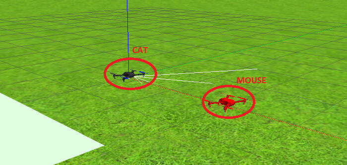
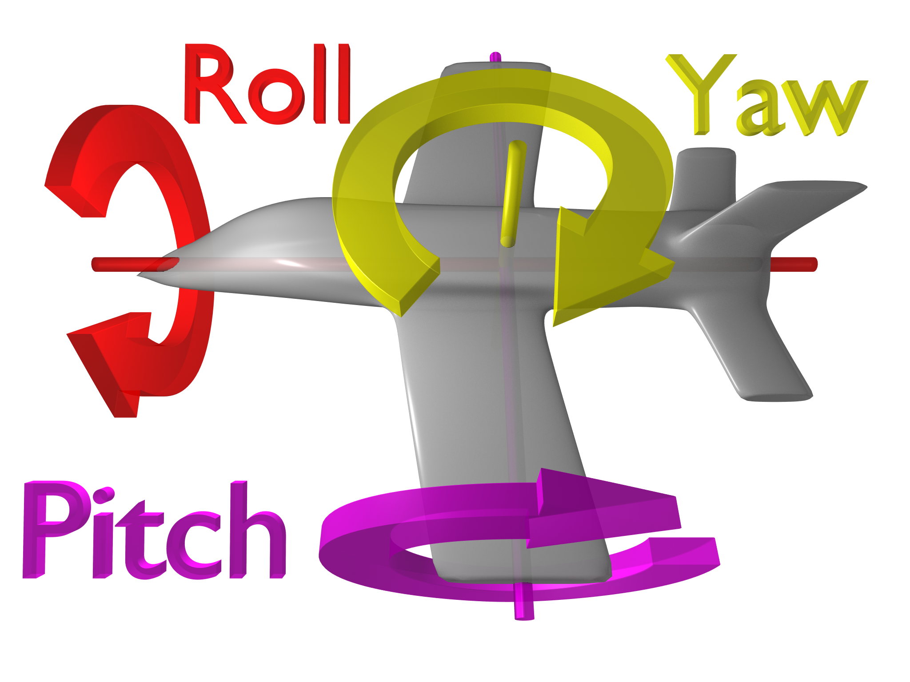
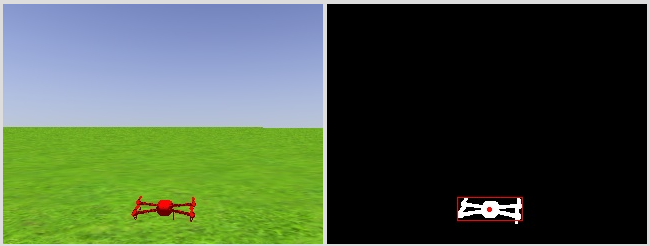

---

title: "Week 3"
excerpt: "Getting started with drones in Robotics-Academy"

---

This week I have started another exercise from Robotics-Academy: [Drone Cat And Mouse Exercise](http://jderobot.github.io/RoboticsAcademy/exercises/Drones/drone_cat_mouse). This exercise involves **2 drones**: one acts as the **mouse** (the red one) and the other acts as the **cat** (the black one). 

The mouse moves randomly and the goal of this exercise is to program the logic/intelligence of the cat: the cat has to search, chase and stay close to the mouse. 

There are several methods accesible through the Hardware Abstraction Layer (HAL) which return information such as the actual position, velocities and angles(yaw, roll, pitch) of the drone. Just as a reminder, the different angles mencioned are represented in the next image:

The methods that allow to control the drone:
- Position control --> **HAL.set_cmd_pos(x, y, z, az)**
- Velocity control --> **HAL.set_cmd_vel(vx, vy, vz, az)**
- Mixed control --> **HAL.set_cmd_mix(vx, vy, x, az)**

The input argument named 'az' represents the **yaw angle**, and it's the only angle that can be controlled. 

In addition, there are some other methods to get and show images from the two cameras of the drone (one frontal and the other one ventral): 
- **HAL.get_frontal_image()**
- **HAL.get_ventral_image()**
- **GUI.showImage(img)**
- **GUI.showLeftImage(img)**

The first step that must be done is to filter the image we get from the frontal camera of the drone. As the mouse is red, a red filter has been implemented. Besides, as a first approach to obtain the position of the mouse, the centroid of the filtered drone has been calculated, as can be seen in the next image:

Once the image is filtered, the next thing I've done is to implement a PD controller in order to control the yaw angle. To check if this controller works, the mouse has been moved manually from right to left:

<iframe width="560" height="315" src="https://www.youtube.com/embed/1NKCO9zqm4E" title="YouTube video player" frameborder="0" allow="accelerometer; autoplay; clipboard-write; encrypted-media; gyroscope; picture-in-picture" allowfullscreen></iframe>

What I have done until now is pretty simple but it has helped me to become familiar with the interface and with the different methods that can be used to control the drone. 

This is all for now! For next week I'll try to add a 'searching method' to find the mouse if it is lost and a way to control and combine the different parameters of the drone (velocity, distance to the mouse, yaw angle and height). 
