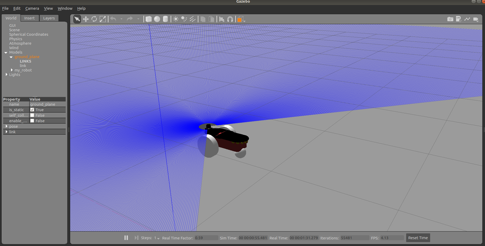

---

title: "Week 4-5"
excerpt: "Getting started with Gazebo"

---
(Pendiente: Pasarlo a inglés)

El objetivo de esta dos semanas ha sido empezar a familiarizarme con Gazebo. Para ello, principalmente he ido siguiendo los tutoriales de la página oficial de Gazebo:[Tutoriales Gazebo](http://gazebosim.org/tutorials). Lo que he aprendido sobre Gazebo hasta ahora se resume en los siguientes puntos:

- El comando para iniciar Gazebo es 'gazebo', que ejecuta conjuntamente gzserver y gzclient. 
  - gzserver: es el motor de Gazebo. Se le pasa un archivo que describe el mundo que queremos ejecutar y lo simula(teniendo en cuenta los sensores, la física...)
  ~~~
  gzserver <world_filename>
  ~~~
  
  - gzclient. Es la interfaz gráfica que permite visualizar los elementos que forman el mundo simulado. 
  ~~~
  gzclient 
  ~~~
  - El comando gazebo combina el servidor y el cliente en un solo ejecutable:
  ~~~
  gazebo <world_filename>
  ~~~

- Construir un robot muy sencillo([Tutorial](http://gazebosim.org/tutorials?tut=build_robot&cat=build_robot)). Para ello ha sido necesario crear un archivo *model.config* y un archivo *model.sdf*. En este último archivo es donde se define la estructura del robot. El robot que se ha construido se ha formado a partir de un bloque rectangular, una esfera y un par de cilindros (ruedas). También se le ha añadido una malla(mesh) para aportar realismo al robot. Por último, se le ha añadido un sensor láser al robot. La estructura del robot resultante se muestra en la siguient imagen:

